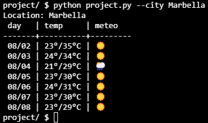

# WEATHER TRACKER
#### Video Demo:  <URL HERE>
#### Description:
This projects displays the forecast data for the next week via user inputs. If the user doesn't send a city or an IP address, the program fetches the IP and tracks the location of that IP via API requests. Once the location has been fetched, it scraps the data on http://www.tiempo.com on the corresponding given city, displaying the data into a formatted table.

The main limitation of the project is the access to the API, as the IP fetching is limited by service on a rate we don't know, and the data of the location can take some time to be fetched into the program. The project also takes the data from http://www.tiempo.com. On a further development, it would be interesting if the user could choose the source of the weather forecast (or merge the data from various sources for more accuracy).

The program also allows the user to input any city and/or IP via program commands.

## Libraries used
### argparse
In order to track and help the user to use the app appropiately, there's a help function available via argparse

[argparse Documentation](https://docs.python.org/3/library/argparse.html)

### requests
It fetches data from different areas:
Via API requests to IPIFY.

[IPIFY Documentation](https://www.ipify.org/)

Via API requests to IPAPI.

[IPAPI Documentation](https://ipapi.com/documentation)

Via BeautifulSoup to scrap data.

[BeautifulSoup Documentation](https://www.crummy.com/software/BeautifulSoup/bs4/doc/)

### sys

In order to access system commands

[sys Documentation](https://docs.python.org/3/library/sys.html)

### tabulate

In oder to display the information in an ordered way